# Installation guide: Amber Energy Dashboard (unofficial)

This guide walks through installing and setting up the integration. If you used the
earlier YAML kit, see the separate [migration guide](MIGRATION.md) once the integration is
set up. For a short overview, see the [README](../README.md).

**Contents**
1. [Before you start](#1-before-you-start)
2. [Install through HACS](#2-install-through-hacs)
3. [Add the integration](#3-add-the-integration)
4. [After setup](#4-after-setup)
5. [Settings](#5-settings)
6. [Add it to the Energy dashboard](#6-add-it-to-the-energy-dashboard)
7. [Migrating from the YAML kit](#7-migrating-from-the-yaml-kit) (separate guide)
8. [Troubleshooting and FAQ](#8-troubleshooting-and-faq)

---

## 1. Before you start

You need:

- **Home Assistant 2026.9 or later.**
- **[HACS](https://hacs.xyz/)** installed.
- **An Amber Electric API key** (see below).

### Creating an Amber API key

1. Sign in to Amber's website and open **For Developers** (https://app.amber.com.au/developers).
   Turn on **Developer mode** if it's off.
2. Click **Generate a new Token**, give it a recognisable name (for example
   "HomeAssistantAmberEnergyDash"), and click **Generate**.

   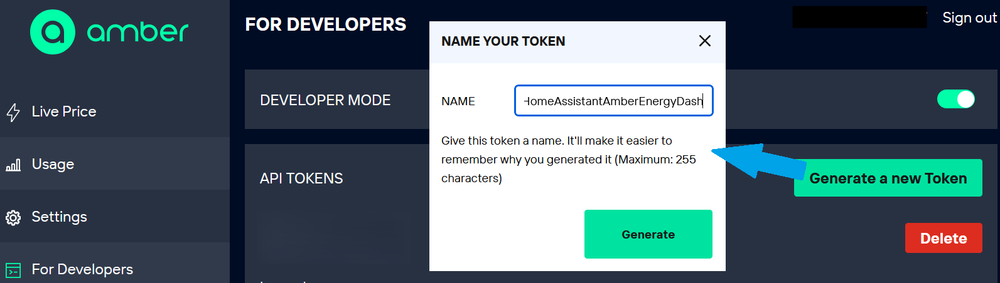

3. **Copy the token straight away** and store it in your password manager. Amber only shows
   it once; it disappears when you refresh the page. It starts with `psk_`.

   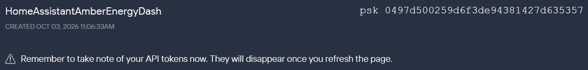

   *(The token in this screenshot was deleted straight after it was taken. Never share a
   working token.)*

The integration works alongside Home Assistant's built-in **Amber Electric** integration,
which provides live prices. You can keep both.

## 2. Install through HACS

1. In HACS, open the **three-dot menu** (top right) and choose **Custom repositories**.

   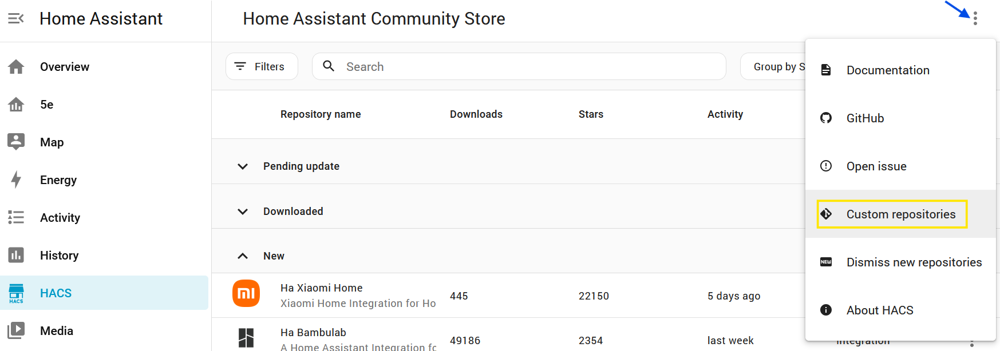

2. Enter `https://github.com/r5e/ha-amber-energy-dashboard`, choose the type
   **Integration**, and click **Add**. Then close the dialog.

   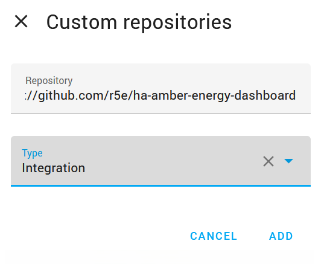

3. Search HACS for **amber**, and open **Amber Energy Dashboard (unofficial)**. (Other
   Amber-related entries in the list are separate projects.)

   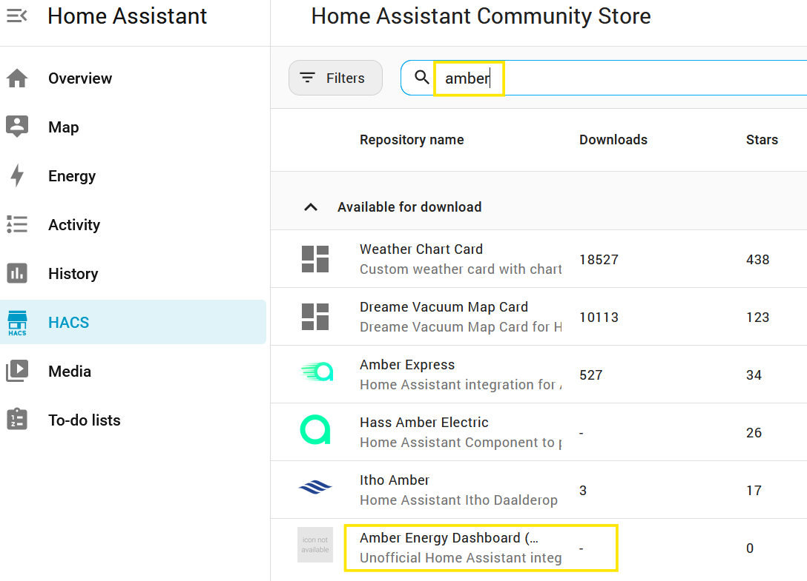

4. Click **Download** (bottom right).

   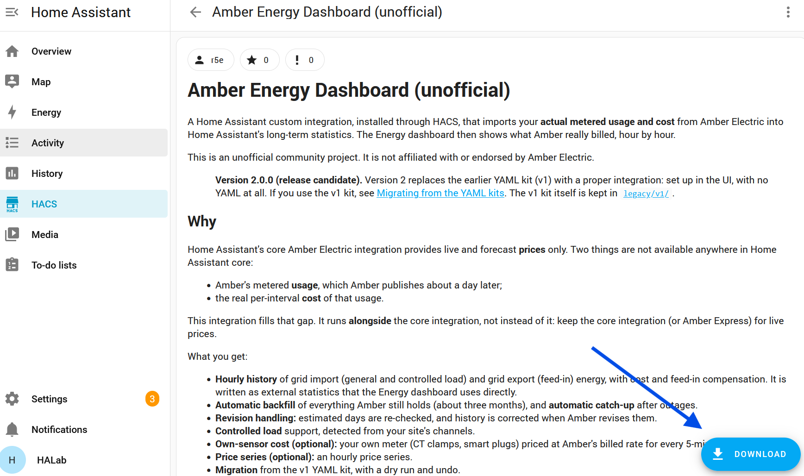

5. Click **Download**, then **restart Home Assistant** when prompted.

   HACS offers the latest release.¹

¹ *Pre-releases (release candidates) are not offered by default. To try one, open **Need a
different version?** in the download dialog and pick it from the list.*

## 3. Add the integration

1. Go to **Settings > Devices & services > Add integration**, and search for **Amber**.
   Choose **Amber Energy Dashboard (unofficial)**, not the built-in Amber Electric
   integration.

   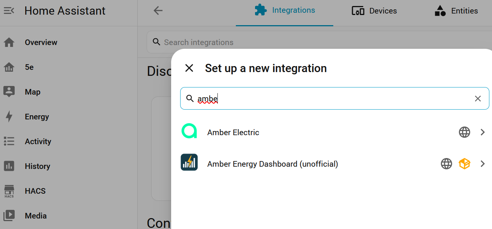

2. **Connect to Amber:** paste your API key and click **Submit**.

   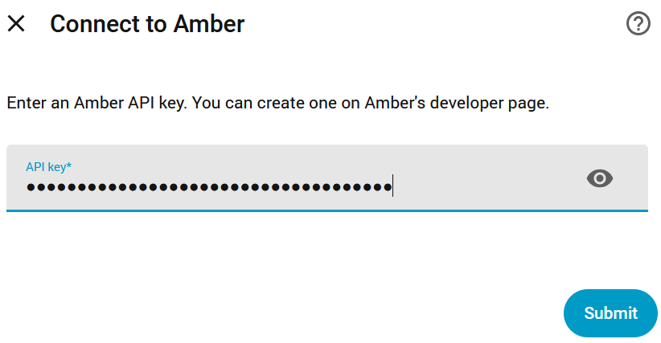

3. **Choose a site:** if your Amber account has more than one site, pick the one to set
   up. Each site becomes its own entry. The site is shown with its NMI and network.

   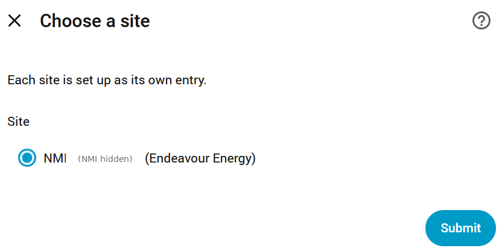

4. **Confirm channels:** the integration lists the metering channels it found, for
   example a general (import) channel and a feed-in (export) channel, each with its
   tariff code. Usage, cost and feed-in compensation are imported for each one.

   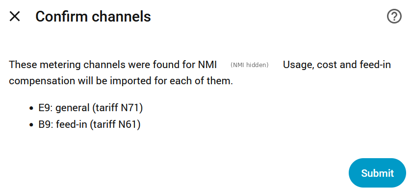

5. **Import schedule:** keep **Automatic** unless you have a reason not to. It picks a
   stable time for your installation each morning (between 06:30 and 08:30), with retries
   3 and 6 hours later. Once the day is imported, the retries are skipped without any API
   calls. **Fixed times** lets you choose up to 6 times yourself.

   If the Energy dashboard has no grid connection yet, this step also offers **Add to the
   Energy dashboard** (on by default). It adds a grid connection with this site's
   consumption and cost and, with feed-in, its return to grid and compensation (a
   controlled load gets a second grid connection), so you can skip section 6. An existing
   grid connection is never changed, and the option isn't shown then.

   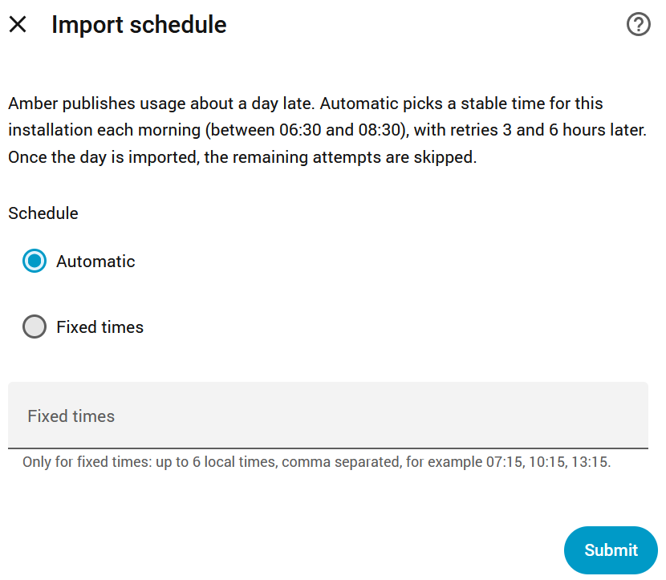

6. **Name and assign:** optionally rename the device or assign it to an area, then click
   **Finish**.

   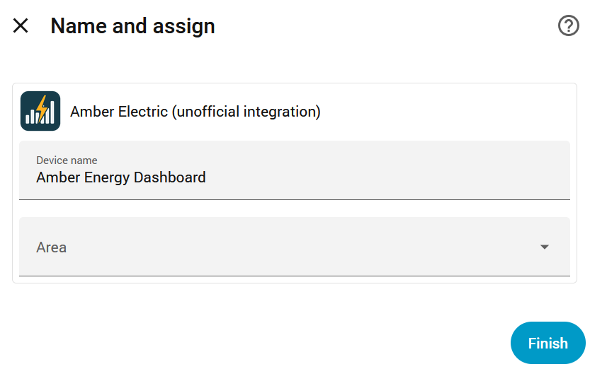

The integration then imports your available history straight away (Amber keeps about 90
days). That takes a minute or two and about 15 API calls.

## 4. After setup

Open the integration's device to see its status:

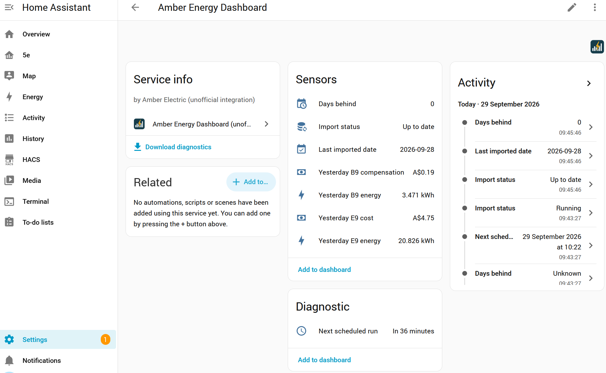

- **Import status** reads **Up to date** when everything is imported.
- **Last imported date** is normally yesterday, because Amber publishes each day's usage
  about a day later.
- **Days behind** is 0 when it's up to date.
- **Yesterday** sensors show the previous day's energy, cost and feed-in compensation per
  channel.
- **Next scheduled run** (under Diagnostic) shows when it will next check.
- **Run now** (under Controls) runs the import straight away, the same as a scheduled run.
  You rarely need it.
- **Re-check retention** (under Diagnostic) finds the oldest day Amber still holds again
  from scratch (at most 8 API calls). The daily check normally follows it by itself.
- **Download diagnostics** produces a file for bug reports. Your API key and NMI are
  redacted from it.

The integration's own page (Settings > Devices & services > Amber Energy Dashboard)
shows the entry for each site:

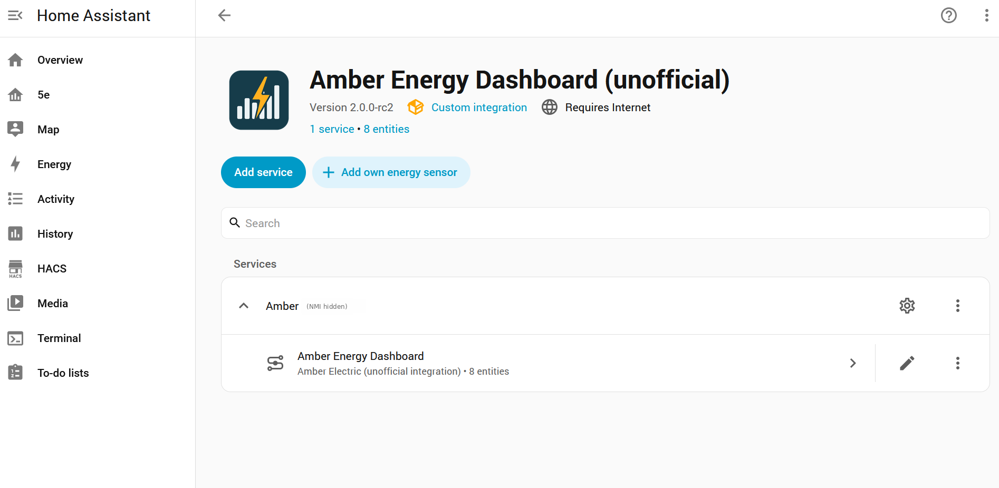

## 5. Settings

On the integration's page, click the **cog** next to your site's entry to open the
options:

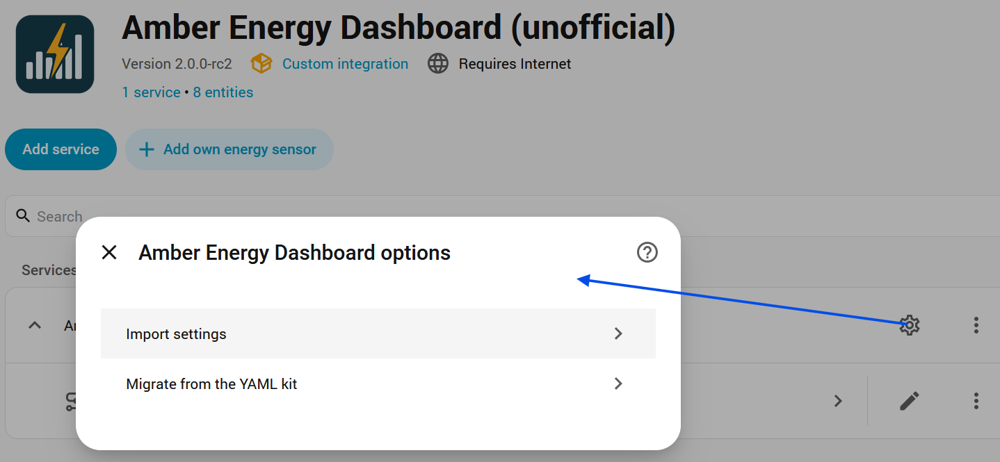

**Import settings** contains:

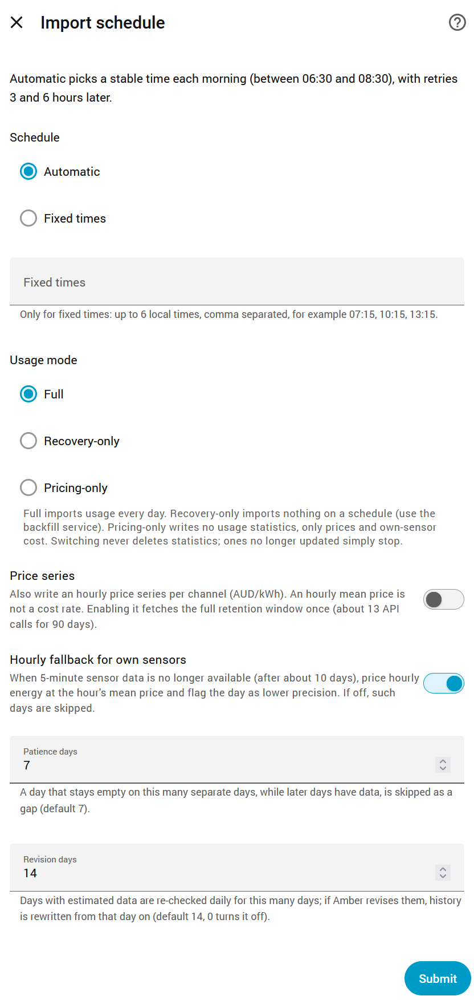

- **Schedule:** Automatic or Fixed times, as during setup.
- **Usage mode:**
  - **Full** (default): imports usage and cost every day.
  - **Recovery-only:** imports nothing on a schedule. Use the `backfill` service to fill a
    date range on demand.
  - **Pricing-only:** writes no usage statistics, only prices and own-sensor cost.

  Switching mode never deletes statistics; ones no longer updated simply stop.
- **Price series:** optionally write an hourly price series per channel. Turning it on
  fetches the full retention window once (about 13 API calls).
- **Hourly fallback for own sensors:** see "Own energy sensors" below.
- **Patience days** and **Revision days:** how long to wait for missing days, and how long
  to re-check days Amber marked as estimated. The defaults suit almost everyone.

### Own energy sensors (optional)

If you measure your own consumption (for example with CT clamps or smart plugs), click
**Add own energy sensor** on the integration's page. The integration then calculates that
sensor's cost at Amber's real 5-minute prices. A whole-house sensor can even be used as
the Energy dashboard's cost source.

## 6. Add it to the Energy dashboard

If you kept **Add to the Energy dashboard** on during setup (section 3), this is already
done. A day after the first import, if nothing in the Energy dashboard uses the
integration's statistics, a Repairs item **"The Energy dashboard isn't using Amber Energy
Dashboard"** appears. Its **Fix** adds them when there is no grid connection, points to
the [migration guide](MIGRATION.md) when the YAML kit is in use, or lets you dismiss it.

To set it up by hand, go to **Settings > Dashboards > Energy**, and in the **Electricity
grid** section, add or edit a grid connection:

- **Energy imported from grid:** the integration's **general** energy statistic.
- **Energy exported to grid:** its **feed-in** energy statistic.
- **Cost tracking:** choose **Use an entity tracking the total costs**, and select the
  **general cost** statistic. Feed-in compensation is set the same way, if offered.

Give the connection a clear display name, such as "Amber grid".

## 7. Migrating from the YAML kit

Only needed if you used the earlier YAML kit. See the separate
**[migration guide](MIGRATION.md)**: it carries your history across and fixes the kit's
feed-in sign, with a dry run and undo.

## 8. Troubleshooting and FAQ

**My feed-in earnings are lower than the export credit on my Amber bill.**
Amber's usage data applies your network's export charges to every interval. Some networks
offer a free export allowance (for example Endeavour Energy's two-way tariff N61, which has
8 kWh per day free before a midday export charge applies), and your bill applies that
allowance, but the usage data doesn't. So the dashboard can show lower feed-in earnings
than the bill. Import costs match the bill to the cent (they include GST; the bill adds GST
at the end).

**My dashboard total doesn't include supply and subscription charges.**
Amber's usage data covers usage only. Daily network supply, metering, and Amber's
subscription are separate charges on your bill.

**Something else.**
Download diagnostics from the integration's device page, and open an issue on GitHub with
the file attached. Your API key and NMI are redacted automatically.
