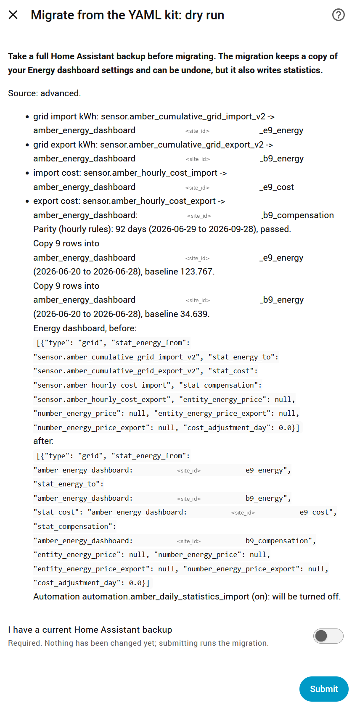
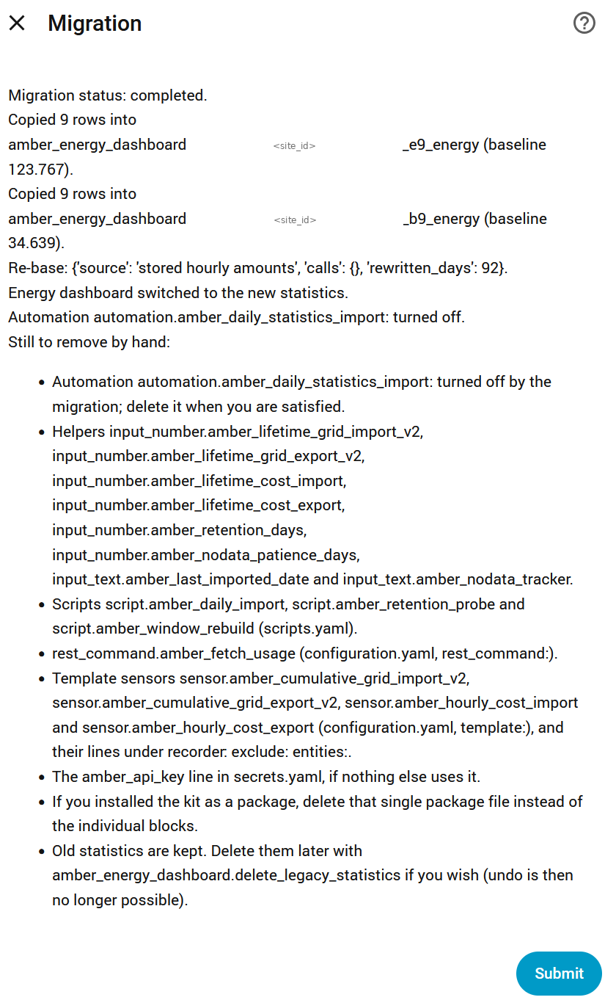
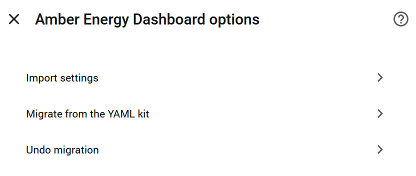

# Migrating from the YAML kit: Amber Energy Dashboard (unofficial)

If you used the earlier YAML kit (`ha-amber-energy-dashboard` v1, or the advanced
version), the integration can carry your history across, so the Energy dashboard shows one
continuous series. **Take a full backup first.**

1. **Install and set up the integration** first, following the
   [installation guide](INSTALL.md), and wait until Import status reads **Up to date**.
2. Open the **options** (the cog) and choose **Migrate from the YAML kit**. The first screen
   is a **dry run**: it changes nothing, and reports what it found and what it would do.

   

   Check that:
   - **Source** shows your kit's layout (v1 or advanced);
   - **Parity** says **passed** (your old and new data agree over the period both cover);
   - the copy, Energy dashboard and automation changes look as you expect.

   If the parity check fails, or the scan flags suspicious rows, the migration stops and
   explains why, without changing anything.
3. Turn on **I have a current Home Assistant backup** and click **Submit** to run it.

   

   The migration:
   - copies your older history into the integration's statistics, so they continue
     seamlessly;
   - **fixes the feed-in sign:** the kit stored feed-in earnings as negative, which made
     the Energy dashboard add them to your cost instead of subtracting them;
   - switches the Energy dashboard to the new statistics;
   - turns off the kit's import automation.
4. **Check the Energy dashboard:** recent days should show the same energy as before, with
   the cost now correctly reduced by your feed-in earnings, and the history should run back
   continuously.
5. **If anything looks wrong,** choose **Undo migration** from the same options menu. It
   restores your previous Energy dashboard settings and turns the old automation back on.

   

## Cleaning up afterwards

After a few days of clean scheduled runs, remove the kit. The migration's result screen
lists everything to remove for your installation: typically the kit's helpers, scripts,
automations, rest command, template sensors and their `recorder: exclude` lines, and the
`amber_api_key` line in `secrets.yaml`. If you installed the kit as a package, deleting
that one package file removes most of it.

Run **Check configuration** and restart afterwards. Then, in Settings > Entities, remove
any leftover Amber entities showing as unavailable. Leave anything belonging to Amber Energy
Dashboard or the built-in Amber Electric integration. If you used the v1 kit's backfill
script, also delete `amber_backfill.py` and `amber_backfill_cache.json` from wherever you
ran it.

Until then, a **Finish removing the YAML kit** notice in Settings > System > Repairs lists
the parts of the kit that are still there. It is re-checked when Home Assistant starts and
after each scheduled import, so it shrinks as you remove things, and clears itself once
they are all gone.

The `amber_api_key` line in `secrets.yaml` is not checked, because another tool may still
use it, so it doesn't keep the Repairs notice open. Remove it yourself once nothing else
uses it.

The old statistics are kept until you choose otherwise. Removing them is optional, so they
don't keep the Repairs notice open. Once you're confident, delete them with the
`amber_energy_dashboard.delete_legacy_statistics` action. After that, Undo is no longer
possible.

## If something goes wrong

Download diagnostics from the integration's device page, and open an issue on GitHub with
the file attached. Your API key and NMI are redacted automatically.
